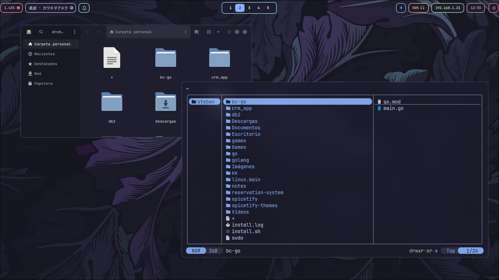
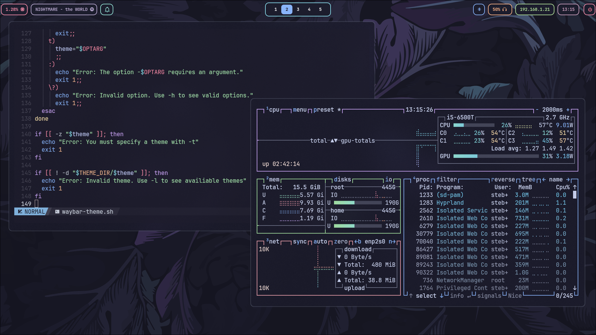
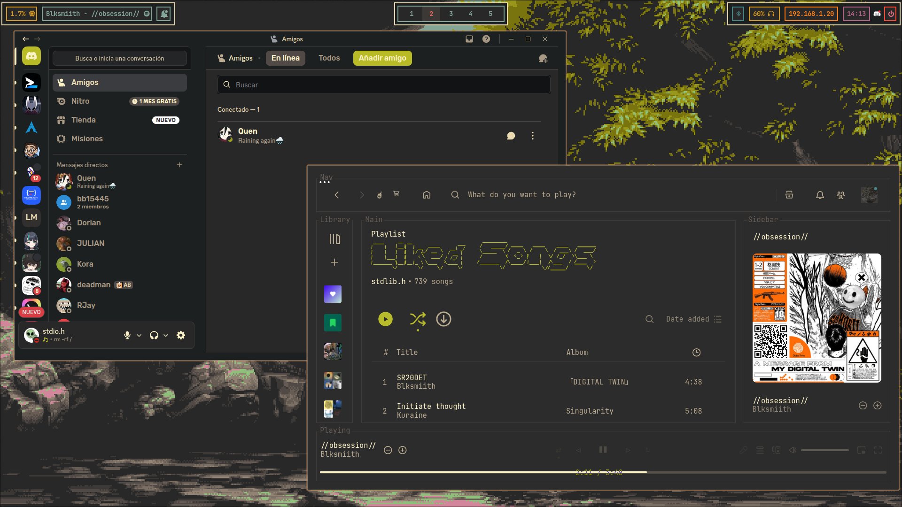
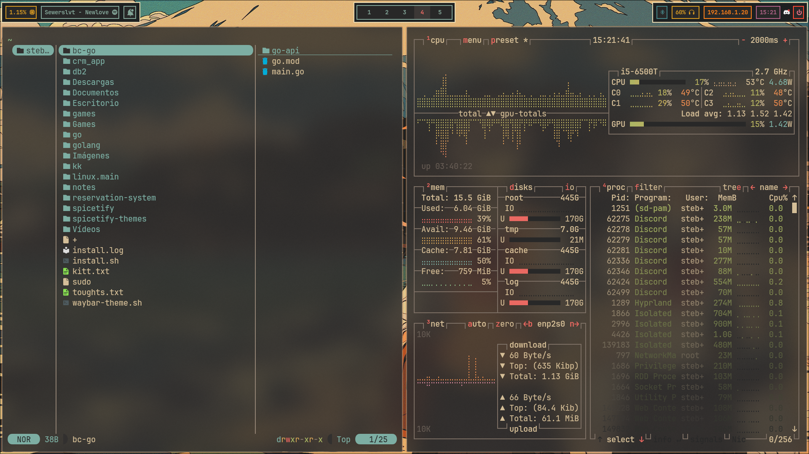
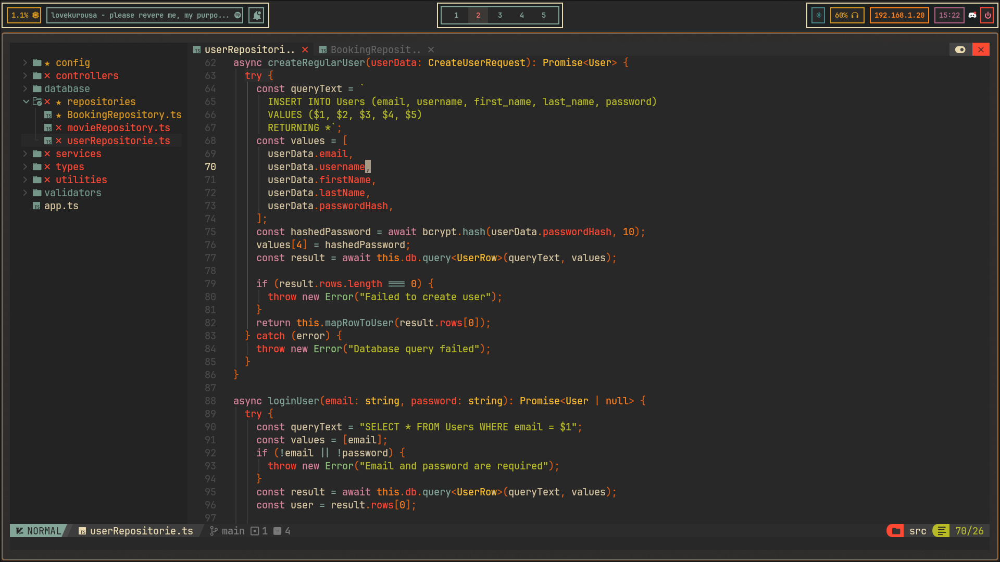
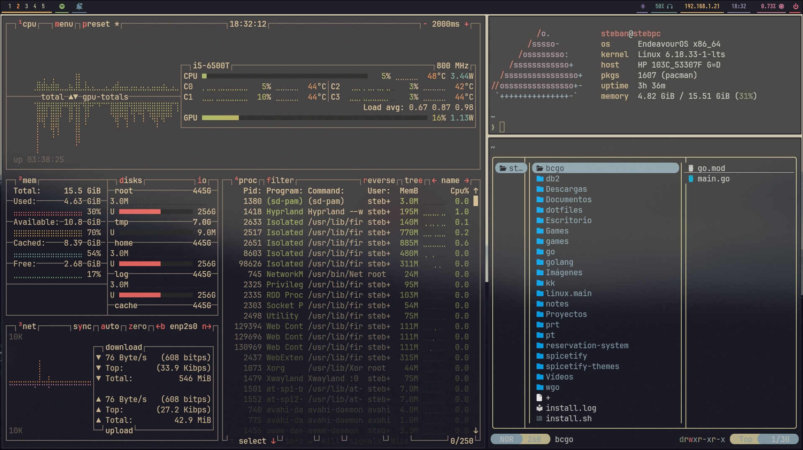
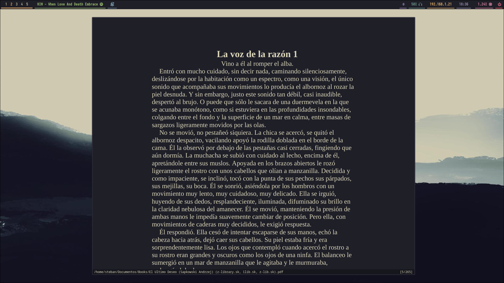
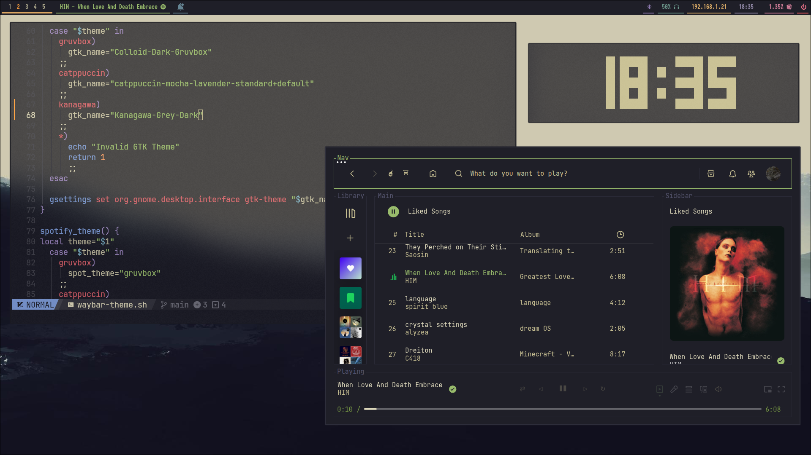

# HyprDotfiles

Hyprland setup featuring different themes like: 
- [catppuccin Mocha](https://catppuccin.com/)
- [gruvbox](https://github.com/morhetz/gruvbox?tab=readme-ov-file)  
- [tokyoNight](https://wixdaq.github.io/Tokyo-Night-Website/index.html)

## Screenshots
<details>

<summary>Catppuccin Mocha</summary>
    



</details>

<details>

<summary>Gruvbox</summary>






</details>


<details>

<summary>Kanagawa</summary>





</details>

## Dependencies 
- **WM**: [Hyprland](https://hypr.land)
- **Terminal**: [Kitty](https://sw.kovidgoyal.net/kitty/)
- **Bar**: [Waybar](https://github.com/Alexays/Waybar)
- **Shell**: **Zsh**
- **FileManager**: [Yazi](https://yazi-rs.github.io/)
- **Editor**: [NvChad](https://nvchad.com/)
- **Notifications**: [SwayNC](https://github.com/ErikReider/SwayNotificationCenter)

## Installation
Clone the repo and `cd` to `~/dotfiles`
```bash
git clone https://github.com/TechDev-01/dotfiles.git
cd dotfiles
```

Make sure you have `stow` installed on your system
```bash
# Arch
sudo pacman -S stow

# Debian
sudo apt install stow

# Fedora
sudo dnf install stow
```

Then generate the symlinks
```bash
stow *
```

## Theme-change script
The scipt is installed in `~/.local/bin/waybar-theme.sh` via GNU Stow.

Make sure it is in your path:
``` bash
echo $PATH
```

If not, add it:
```bash
export PATH="$HOME/.local/bin:$PATH"
```

## Usage

After that you can use the script like this
```bash
waybar-theme.sh -l # list the available themes
waybar-theme.sh -t <theme_name> # Set the theme
waybar-theme.sh -h # Prints help
```
